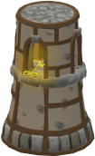
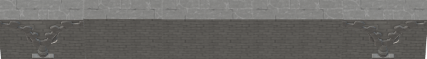

# Vyuha1
2D game layout design using C++ and SFML 2.5.1

## Sprite Creation
I have used Windows 10 Paint 3D to create character animations for the game.

Player is the main character modelled to mimic movement in all four directions when left/right/up/down arrow key is pressed. Player also displays weapon in all four directions when A/W/S/D key is pressed.

There are some replicas in the sprite sheet which will act as place holders for additional player animations.

Key is a static element placed at the end point of game for the player to reach.

Wall is a static element, that the player has to navigate through to reach the Key.

## Game layout so far

