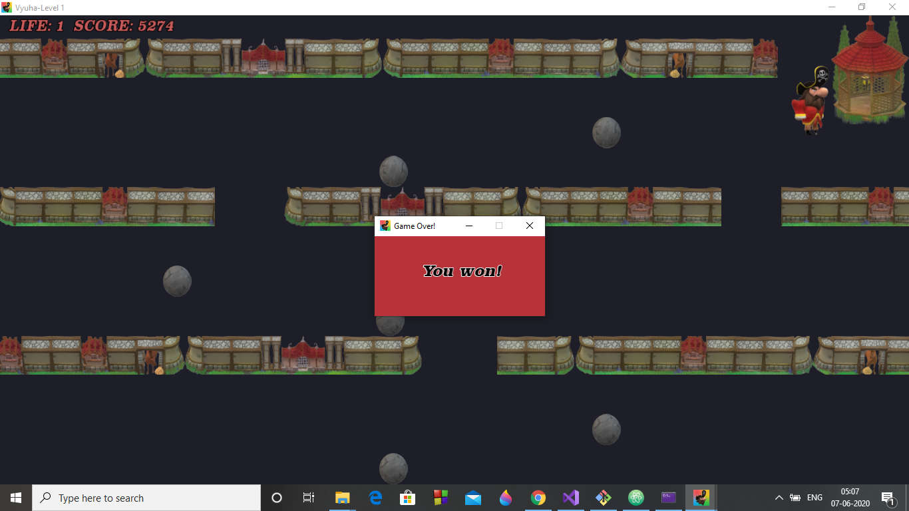

## What is Vyuha1?
 Vyuha1 is a 2D game for Windows 10 Operating System. It's built using [C++](https://en.wikipedia.org/wiki/C%2B%2B) and [SFML 2.5.1](https://www.sfml-dev.org/).

## How to play?
Player's mission is to reach the town's Gazebo. Use the arrow keys to move around the town. But, beware of the patrolling cannonballs. Dodge them to keep your score high enough to clear Vyuha1! See Game window below.

## Technical Features
| Feature | Class usage |
| ----- | --- |
| Window creation and settings | sf::RenderWindow |
| Application icon | sf::Image and sf::RenderWindow |
| Player, Key and Wall animation | sf::Texture, sf::Sprite and Character class |
| Player movements | Character class member functions, sf::Sprite and sf::Event's KeyPressed event check |
| Boundary collision detection | sf::Sprite's getPosition() and sf::RenderWindow's getGlobalBounds() are used in Character class's checkBoundaryCollision() |
| Player vs Wall/Key collision | sf::Sprite's getGlobalBounds() is used to check intersects() and based on 4 direction collision condition, player's position is reset in Character class's checkObjectCollision() |
| Enemy creation and movement | sf::Texture, sf::Sprite and Character class are used to create enemy entity canon ball. |
| Player vs Enemy collision | Character class's checkObjectCollision() used, additionally a notCollided flag controls when the canon ball stops moving. This is one of the cases where player score is updated |
| Score calculation and display | sf::Font and sf::Text used to display score. The integer score needs to be converted to string before display. Absolute value of velocity is added to score. |
| Background music | sf::Music is used to stream music from a .ogg file. Looping is set to True. Pitch has been reset to 1.05f to match the pace of player. Volume is on a lower setting of 20. Credits are at the end of the page. |
| Added win condition | Player must reach the key location(Gazebo) with score greater than 5000. Then Game Over window overrides game window. User to close game over window to exit Vyuha1. |

## Sprite creation and description
I've used Windows 10 Paint 3D to create character sprite sheets and animations for the game. The 3D library provides wide range of 3D models. I enjoyed playing with different models, visualizing the look and feel of the game layout.

From a very basic looking wall structure to designing a fictional 18th century town was fun. The player sprite is a Pirate. His attire has been changed to bright red with golden rim to make him standout. In creating the sprite sheets I understood what dimensions work best on the layout and especially for collision detection. If the Player occupies the entire bounding rectangle, without much gaps, then the collisions appear natural.

Below is the description of what each sprite represents:

Player is the main character modelled to mimic movement in all four directions when left/right/up/down arrow key is pressed. There are some replicas in the sprite sheet which will act as place holders for additional player animations.

Key(Gazebo) is a static element placed at the end point of game for the player to reach.

Wall(Town structures) is a static element, that the player has to navigate through to reach the Key.

Canon ball is an enemy entity that moves to block the player on each level unless the player blocks it first.

Game icon in title bar and thumbnail:

## Game layout
Game window:

Game over window:

## Music credits
Blind Love Dub by Jeris (c) copyright 2017 Licensed under a Creative Commons Attribution (3.0) license. http://dig.ccmixter.org/files/VJ_Memes/55416 Ft: Kara Square (mindmapthat)

### Created by Pannaga Rao.
