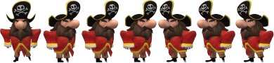
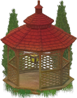
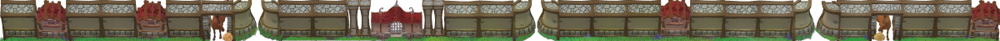
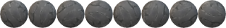
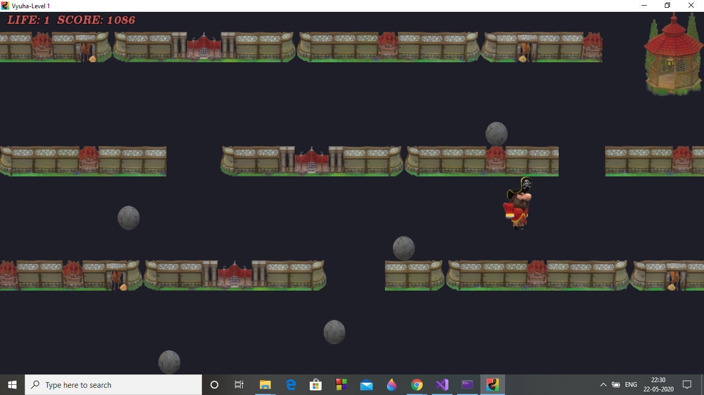
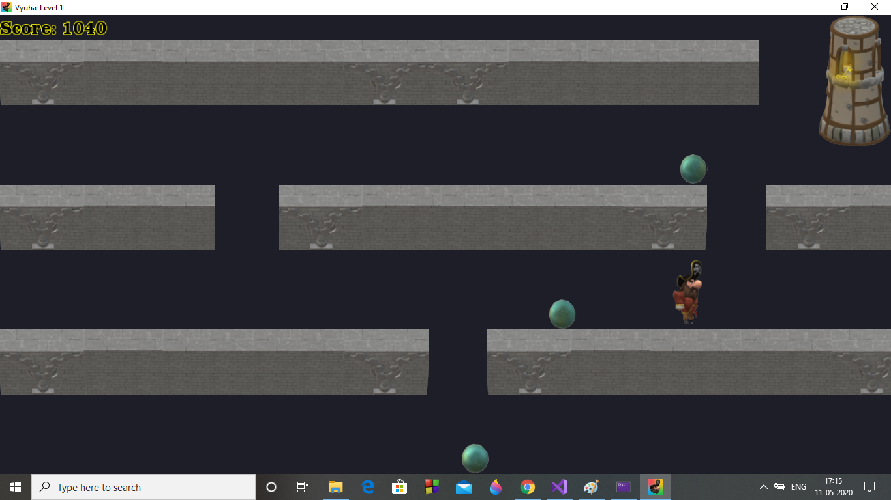

# Vyuha1
2D game layout design using C++ and SFML 2.5.1

## Features
| Feature | Class usage |
| ----- | --- |
| Window creation and settings | sf::RenderWindow |
| Application icon | sf::Image and sf::RenderWindow |
| Player, Key and Wall animation | sf::Texture, sf::Sprite and Character class |
| Player movements | Character class member functions, sf::Sprite and sf::Event's KeyPressed event check |
| Boundary collision detection | sf::Sprite's getPosition() and sf::RenderWindow's getGlobalBounds() are used in Character class's checkBoundaryCollision() |
| Player vs Wall/Key collision | sf::Sprite's getGlobalBounds() is used to check intersects() and based on 4 direction collision condition, player's position is reset in Character class's checkObjectCollision() |
| Enemy creation and movement | sf::Texture, sf::Sprite and Character class are used to create enemy entity canon ball. |
| Player vs Enemy collision | Character class's checkObjectCollision() used, additionally a notCollided flag controls when the canon ball stops moving. This is one of the cases where player score is updated |
| Score calculation and display | sf::Font and sf::Text used to display score. The integer score needs to be converted to string before display. Absolute value of velocity is added to score. |
| Background music | sf::Music is used to stream music from a .ogg file. Looping is set to True. Pitch has been reset to 1.05f to match the pace of player. Volume is on a lower setting of 20. Credits are at the end of the page. |

## Sprite Creation
I have used Windows 10 Paint 3D to create character animations for the game.

Player is the main character modelled to mimic movement in all four directions when left/right/up/down arrow key is pressed. Player also displays weapon in all four directions when A/W/S/D key is pressed.

There are some replicas in the sprite sheet which will act as place holders for additional player animations.

Key is a static element placed at the end point of game for the player to reach.

Wall is a static element, that the player has to navigate through to reach the Key.

Canon ball is an enemy entity that moves to block the player on each level unless the player blocks it first.

Game icon in title bar and thumbnail:

## Game layout evolution
Newer version:

Older version:

## Music credits
Using First 15s from Blind Love Dub by Jeris (c) copyright 2017 Licensed under a Creative Commons Attribution (3.0) license. http://dig.ccmixter.org/files/VJ_Memes/55416 Ft: Kara Square (mindmapthat)
