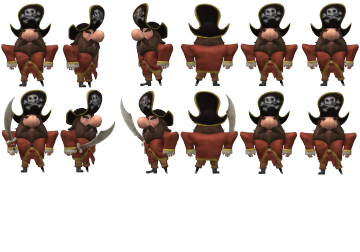
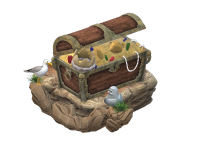

# Vyuha1
2D boardgame layout design using C++ and SFML 2.5.1

## Player Sprite Creation
I have used Windows 10 Paint 3D to create character animations for the game.

Player is the main character modeled to mimic movement in all four directions when left/right/up/down arrow key is pressed. Player also displays weapon in all four directions when A/W/S/D key is pressed. 

There are some replicas in the sprite sheet which will act as place holders for additional player animations.

Treasure is a static character placed at the end point of game for the player to reach.

